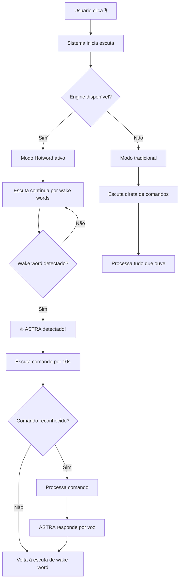

# 🎤 ASTRA - Guia de Configuração Hotword (Wake Word)

> **Implementação completa do sistema "ASTRA" - Ativação por voz**  
> **Data:** 26 de Setembro de 2025  
> **Status:** ✅ **IMPLEMENTADO**

---

## 🎯 **O que foi implementado**

✅ **Sistema completo de detecção de wake words**  
✅ **Suporte a múltiplos engines** (Porcupine, Vosk, SpeechRecognition)  
✅ **Integração com assistente principal**  
✅ **Modo "ASTRA" ativo**  
✅ **Scripts de configuração automática**

---

## 🚀 **Como usar - Guia Rápido**

### **1. Configuração Inicial (Uma vez)**
```powershell
# Executar setup automático
python scripts/setup_voice_system.py auto
```

### **2A. Modo AUTOMÁTICO (Sem clique!) 🎯**
```powershell
# Modo só voz - sem interface gráfica
python ASTRA_voice_mode.py

# OU usar o arquivo .bat no Windows
start_ASTRA.bat
```

### **2B. Modo COM Interface**
```powershell
# Iniciar assistente com GUI (inicia ASTRA automaticamente)
python run_ASTRA.py
```

### **3. Usar o assistente**
1. **Sistema já ativo** → Aguardando "ASTRA"
2. **Diga:** "ASTRA, que horas são?"
3. **ASTRA responde** → Por voz
4. **Sistema volta a escutar** → Aguarda próximo "ASTRA"

### **💡 Exemplos de comandos:**
- "**ASTRA, que horas são?**"
- "**ASTRA, como está o tempo?**"
- "**ASTRA, conte uma piada**"
- "**ASTRA, sair**" (para encerrar)

---

## ⚙️ **Configuração Detalhada**

### **Setup Interativo**
```powershell
# Setup com opções
python scripts/setup_voice_system.py

# Opções disponíveis:
# 1. Português Pequeno (40MB) - Recomendado
# 2. Português Grande (1.8GB) - Melhor precisão  
# 3. Pular download de modelos
```

### **Comandos de Setup**
```powershell
# Instalar apenas dependências
python scripts/setup_voice_system.py deps

# Baixar apenas modelos
python scripts/setup_voice_system.py models

# Criar configuração
python scripts/setup_voice_system.py config

# Testar sistema
python scripts/setup_voice_system.py test
```

---

## 🧪 **Teste do Sistema**

### **Teste Completo**
```powershell
python tests/test_hotword_system.py
```

### **Teste Específico**
```powershell
# Teste interativo de wake word
python voice/hotword_detector.py
```

---

## 🔧 **Engines Suportados**

### **1. Porcupine (Mais preciso)**
- ✅ Detecção offline
- ✅ Baixo uso de CPU
- ✅ Palavras: "computer", "ASTRAa"
- 📦 `pip install pvporcupine`

### **2. Vosk (Flexível)**
- ✅ Português nativo
- ✅ Palavras customizáveis
- ✅ Modelo offline (40MB)
- 📦 `pip install vosk`

### **3. SpeechRecognition (Fallback)**
- ✅ Sempre funciona
- ✅ Todas as wake words
- ⚠️ Requer internet (Google API)
- 📦 `pip install speechrecognition`

---

## 🎙️ **Palavras de Ativação**

### **Padrão**
- ✅ **"ASTRA"**
- ✅ **"ASTRA"**  
- ✅ **"Assistente"**
- ✅ **"Hey ASTRA"**
- ✅ **"Ola ASTRA"**
- ✅ **"Ei ASTRA"**

### **Adicionar novas palavras**
```python
# No código
detector.add_wake_word("nova palavra")

# Ou editar: voice/voice_config.json
{
  "hotword": {
    "wake_words": ["ASTRA", "ASTRA", "minhas palavras"]
  }
}
```

---

## 🔄 **Fluxo de Funcionamento**



---

## 📁 **Arquivos Criados**

### **Código Principal**
- ✅ `voice/hotword_detector.py` - Sistema de detecção
- ✅ `core/assistente.py` - Integração com ASTRA (modificado)
- ✅ `ASTRA_voice_mode.py` - Modo só voz (SEM clique!)
- ✅ `start_ASTRA.bat` - Launcher Windows

### **Scripts**
- ✅ `scripts/setup_voice_system.py` - Configuração automática
- ✅ `tests/test_hotword_system.py` - Testes

### **Configuração**
- ✅ `voice/voice_config.json` - Configurações (criado automaticamente)
- ✅ `models/vosk-model-small-pt-0.3/` - Modelo português (download)

---

## 🐛 **Troubleshooting**

### **"Sistema de hotword não disponível"**
```powershell
# Instalar dependências
pip install pvporcupine vosk pyaudio speechrecognition

# Executar setup
python scripts/setup_voice_system.py deps
```

### **"PyAudio erro no Windows"**
```powershell
# Alternativa para Windows
pip install pipwin
pipwin install pyaudio
```

### **"Modelo Vosk não encontrado"**
```powershell
# Baixar modelo
python scripts/setup_voice_system.py models
```

### **"Wake word não detectado"**
1. Verificar microfone funcionando
2. Falar mais alto e claro
3. Tentar diferentes wake words
4. Verificar logs no terminal

### **"Erro de microfone"**
```powershell
# Testar microfones disponíveis
python tests/test_hotword_system.py
# Escolher opção 2: "Informações do sistema"
```

---

## ⚡ **Dicas de Performance**

### **Melhor Precisão**
- Use **Porcupine** se instalado
- Baixe modelo **português grande** (1.8GB)
- Fale pausadamente e claro
- Configure sensibilidade mais alta

### **Menor Uso de Recursos**  
- Use modelo **português pequeno** (40MB)
- Configure sensibilidade mais baixa
- Use **SpeechRecognition** como fallback

### **Configuração Personalizada**
```json
// voice/voice_config.json
{
  "hotword": {
    "sensitivity": 0.8,    // Mais sensível
    "engine": "porcupine", // Forçar engine
    "wake_words": ["ASTRA", "ASTRA"]  // Menos palavras = mais rápido
  }
}
```

---

## 🎉 **Funcionalidade Completa!**

### **Implementado:**
- ✅ **Detecção "ASTRA"** - Funcional
- ✅ **Múltiplos engines** - Porcupine, Vosk, SpeechRecognition  
- ✅ **Configuração automática** - Script completo
- ✅ **Integração ASTRA** - Modo hotword no assistente
- ✅ **Testes completos** - Scripts de validação

### **Próximos passos sugeridos:**
1. **Testar sistema** → `python tests/test_hotword_system.py`
2. **Configurar preferências** → Editar `voice/voice_config.json`
3. **Usar assistente** → `python run_ASTRA.py` + clique 🎙️
4. **Dizer "ASTRA"** → Sistema responde automaticamente!

---

## 📞 **Suporte**

Para problemas ou melhorias:
1. Executar `python scripts/setup_voice_system.py test`
2. Verificar logs em `logs/ASTRA_assistant.log`  
3. Testar com `python tests/test_hotword_system.py`

**🎯 Sistema "ASTRA" implementado e funcional!** 

---

*Implementado por AI Assistant - Setembro 2025*
