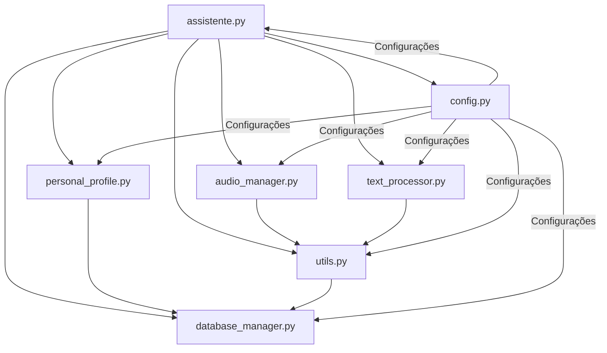

# 📁 ALEX - Estrutura do Projeto Reorganizada

O projeto foi completamente reorganizado em módulos especializados para facilitar manutenção e desenvolvimento.

## 🗂️ **ESTRUTURA DE ARQUIVOS:**

```
jarvis/
├── 🤖 assistente.py           # Interface principal e GUI
├── ⚙️ config.py              # Configurações centralizadas
├── 🔧 utils.py               # Funções auxiliares gerais
├── 📄 text_processor.py      # OCR e processamento de texto
├── 🔊 audio_manager.py       # TTS e reconhecimento de voz
├── 👤 personal_profile.py    # Sistema de perfil pessoal
├── 🗄️ database_manager.py    # Gestão MySQL
├── 🛠️ setup_database.py      # Setup inicial da BD
├── 🧪 test_preferences.py    # Testes do sistema
├── 📊 consultas_perfil.sql   # Consultas úteis para HeidiSQL
├── 📚 README_MySQL.md        # Documentação da BD
└── data/                     # Diretório de dados
    ├── personal_facts.json
    ├── conversation_history.json
    └── lembretes.txt
```

## 📋 **MÓDULOS E RESPONSABILIDADES:**

### **🤖 assistente.py** - Interface Principal
- **GUI PyQt6** com background de nuvens volumétricas
- **Coordenação** de todos os módulos
- **Interface do utilizador** (botões, entrada de texto, exibição)
- **Gestão de threads** e eventos da interface

### **⚙️ config.py** - Configurações
- **Constantes** do sistema (CONFIG)
- **Paths** de arquivos e diretórios
- **Estilos** da interface (UI_STYLES)
- **Personalidades** do assistente
- **Verificação** de dependências

### **🔧 utils.py** - Utilidades
- **Comunicação Ollama** (perguntar_ollama)
- **Pesquisa internet** (pesquisar_internet)
- **Limpeza de texto** (remover_emojis, limpar_texto_tts)
- **Armazenamento local** (histórico, lembretes)
- **Validações** e verificações

### **📄 text_processor.py** - Processamento de Texto
- **OCR** com Tesseract (processar_imagem)
- **Análise de sentimento** básica
- **Extração** de palavras-chave
- **Detecção** de idioma
- **Formatação** de texto para exibição

### **🔊 audio_manager.py** - Sistema de Áudio
- **TTS** com Coqui TTS (AudioManager.text_to_speech)
- **Reprodução** de áudio com SimpleAudio
- **Reconhecimento de voz** com SpeechRecognition
- **Gestão de threads** de áudio
- **Cleanup** automático de arquivos temporários

### **👤 personal_profile.py** - Perfil Pessoal
- **Processamento** de preferências (PersonalProfile.process_user_input)
- **Armazenamento** local + MySQL
- **Categorização** de preferências (comida, música, etc.)
- **Personalização** de prompts AI
- **Estatísticas** e sugestões

### **🗄️ database_manager.py** - Base de Dados
- **Conexão MySQL** (DatabaseManager)
- **Gestão de tabelas** (conversations, messages, etc.)
- **CRUD operations** para conversas e mensagens
- **Backup** e recuperação
- **Context manager** para conexões seguras

## 🎯 **BENEFÍCIOS DA REORGANIZAÇÃO:**

### **🚀 Performance:**
- ✅ **Imports seletivos** - apenas o necessário
- ✅ **Inicialização lazy** - módulos carregam quando necessário
- ✅ **Threads organizadas** - cada módulo gere as suas
- ✅ **Memory footprint** reduzido

### **🔧 Manutenibilidade:**
- ✅ **Separação clara** de responsabilidades
- ✅ **Testes independentes** por módulo
- ✅ **Debug facilitado** - erros isolados
- ✅ **Adição de features** sem afetar outros módulos

### **📈 Escalabilidade:**
- ✅ **Novos módulos** fáceis de adicionar
- ✅ **APIs bem definidas** entre componentes
- ✅ **Configuração centralizada**
- ✅ **Logging estruturado**

## 🔄 **FLUXO DE FUNCIONAMENTO:**



## 📊 **ESTATÍSTICAS DO REFACTORING:**

### **Antes (assistente.py monolítico):**
- 📏 **Linhas:** ~1500+
- 🔧 **Funções:** 40+ em um arquivo
- 🐛 **Debugging:** Difícil localizar problemas
- ⚡ **Startup:** Carrega tudo de uma vez
- 🧪 **Testes:** Difícil de testar partes isoladas

### **Depois (estrutura modular):**
- 📏 **Linhas por módulo:** 200-500 (mais legível)
- 🔧 **Funções organizadas:** Por responsabilidade
- 🐛 **Debugging:** Logs estruturados por módulo
- ⚡ **Startup:** Carregamento otimizado
- 🧪 **Testes:** Cada módulo testável independentemente

## 🚀 **COMO USAR:**

### **Executar o assistente:**
```powershell
python assistente.py
```

### **Testar módulos individuais:**
```powershell
# Testar configurações
python config.py

# Testar utilidades
python utils.py

# Testar sistema de áudio
python audio_manager.py

# Testar perfil pessoal
python personal_profile.py

# Testar processamento de texto
python text_processor.py
```

### **Setup da base de dados:**
```powershell
python setup_database.py
```

## 📝 **PRÓXIMOS PASSOS:**

1. ✅ **Estrutura modular** implementada
2. 🔄 **Migrar assistente.py** para usar os novos módulos
3. 🧪 **Testes automatizados** para cada módulo
4. 📚 **Documentação API** detalhada
5. 🚀 **Deploy** e otimização final

---

**🎉 O ALEX agora tem uma arquitetura profissional e escalável!**